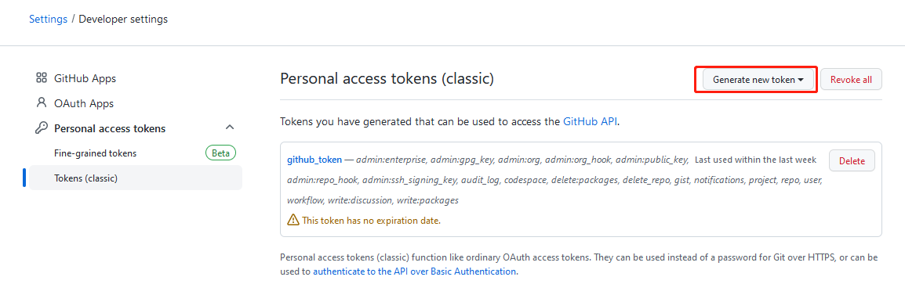
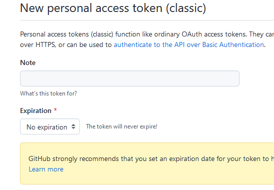
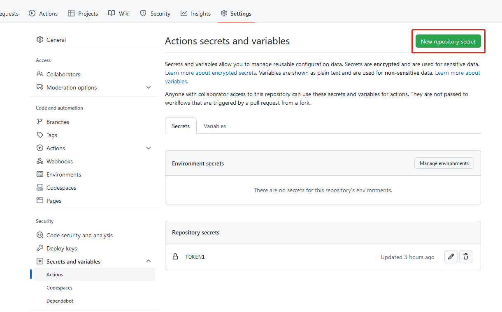
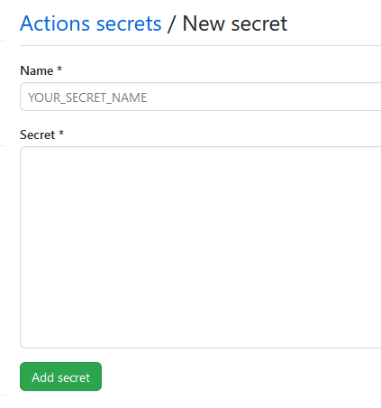
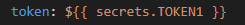
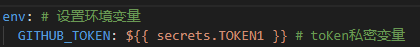

# actions-workflow

test github actions workflow.

## 解决token的问题：

在GitHub的个人设置里添加secrets token认证。

### 生成token

打开GitHub的Settings->Developer settings->Personal access tokens->Tokens(classic)->Generate new token

设置名称，将使用日期修改为无期限。勾选所有选项。

点击底部的Generate token生成TOKEN。页面会弹出一串字符串（密钥），将密钥复制下来。注意密钥只展示一次，刷新网页后就不显示了。

### 添加到仓库的Secrets中

打开需要添加token的仓库。

点击Settings->Secrets and variables->Actions->New repository secret

在Name栏填入名称，这个名称需要记住，到时候需要用到.yaml文件中。例如上图中增加的TOKEN1。

在Secret栏填入上一步获取的密钥，然后点击Add secret。

### 应用示例

将增加TOKEN1增加到secrets的变量中。

